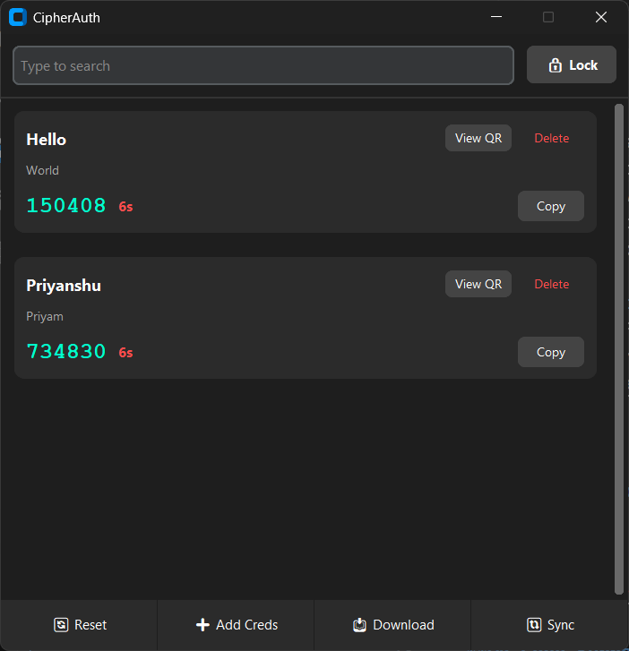
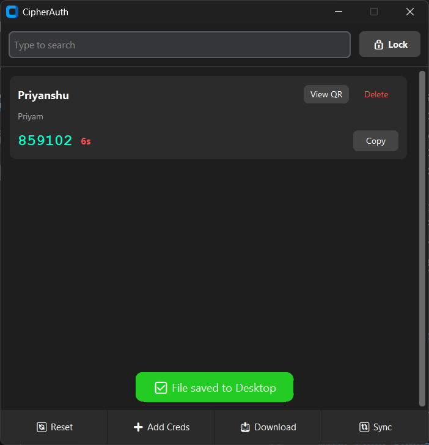

# CipherAuth 🔐

CipherAuth is a secure, cross-platform TOTP (Time-based One-Time Password) authenticator applications designed for simplicity and security. Built with Python and a modern UI powered by CustomTkinter, it provides a safe vault for your two-factor authentication tokens.

> **Repository Status:** This Python repository has been migrated to the Flutter version and is now archived.
> Active development continues at [CipherAuth-Flutter](https://github.com/ppriyanshu26/CipherAuth-Flutter).

## ✨ Features

- **Encrypted Storage:** All your credentials are encrypted with AES-256.
- **Modern UI:** Clean, dark-themed interface using CustomTkinter.
- **Search:** Quickly find your accounts with the built-in search bar.
- **QR Code Support:** View and scan QR codes for easy setup.
- **Export/Import:** Easily backup and restore your credentials.
- **Password Protected:** Secured by a master password to prevent unauthorized access.
- **Sync:** Sync your credentials securely to another device.

## 📸 App Walkthrough (User Flow)

<p align="center"><strong>Create Screen</strong> - First-time setup screen to create your secure vault.</p>

<p align="center">
   
</p>

<p align="center"><strong>Login Screen</strong> - Start by unlocking CipherAuth using your master password.</p>

<p align="center">
   
</p>

<p align="center"><strong>Initial Home Screen</strong> - Empty-state dashboard after setup, before adding any credentials.</p>

<p align="center">
   
</p>

<p align="center"><strong>Add Credentials Manually</strong> - Add an account by entering details manually.</p>

<p align="center">
   
</p>

<p align="center"><strong>Add Credentials with QR Image</strong> - Import account details quickly by scanning a QR image.</p>

<p align="center">
   
</p>

<p align="center"><strong>Home Screen</strong> - Main dashboard showing your saved authentication entries.</p>

<p align="center">
   
</p>

<p align="center"><strong>Blurred QR View</strong> - Protected QR preview state for safer on-screen visibility.</p>

<p align="center">
   
</p>

<p align="center"><strong>Unblurred QR View</strong> - Reveal the QR code when needed for scanning and setup.</p>

<p align="center">
   
</p>

<p align="center"><strong>Download / Export</strong> - Export your credentials backup file securely.</p>

<p align="center">
   
</p>

<p align="center"><strong>Sync Screen</strong> - Sync encrypted credentials across devices on the same network.</p>

<p align="center">
   
</p>

<p align="center"><strong>Reset Password</strong> - Change your master password while keeping data protected.</p>

<p align="center">
   
</p>

<p align="center"><strong>Delete Credentials</strong> - Remove entries you no longer need from the vault.</p>

<p align="center">
   
</p>

## 🛠️ Development & Compilation

CipherAuth can be compiled for Windows, macOS, and Linux without additional code changes. However, this repository has only been tested on Windows.

### Running from Source

1. Clone the repository.
2. Install dependencies:
   ```bash
   pip install -r requirements.txt
   ```
   
   > **Note for Windows users:** PyInstaller packages are commented out in `requirements.txt`. If you're on Windows and planning to build an executable, uncomment the Windows-specific packages in `requirements.txt` before installing:
   > ```
   > altgraph==0.17.4
   > pefile==2023.2.7
   > pyinstaller==6.15.0
   > pyinstaller-hooks-contrib==2025.8
   > pywin32-ctypes==0.2.3
   > ```

3. Run the application:
   ```bash
   python app/main.py
   ```

### Compiling with PyInstaller

The project includes a `CipherAuth.spec` file, making it easy to create a standalone executable for your current OS.

1. Install PyInstaller:
   ```bash
   pip install pyinstaller
   ```
2. Build the executable:
   ```bash
   pyinstaller CipherAuth.spec
   ```
3. The compiled application will be available in the `dist/` folder.

## ❓ FAQ

### How do I add a new account?
Click on the **"➕ Add Creds"** button in the footer and fill in the account details.

### How do I back up my tokens?
Use the **"📥 Download"** button to export a decrypted version of your credentials. Keep this file safe!

### Can I use this on Mac or Linux?
Yes. Since it is written in Python, you can run it from source or compile it using PyInstaller on macOS and Linux as well. However, this repository is only tested on Windows. For mobile platforms and ongoing development, use [CipherAuth-Flutter](https://github.com/ppriyanshu26/CipherAuth-Flutter).

### Is my data synced to the cloud?
No. CipherAuth is designed to be fully offline for maximum privacy. Your data stays on your device. However, you can sync your credentials across multiple devices on the same network using the built-in **Sync** feature (🔃). Devices must have the same master password encryption key to synchronize securely.

## ⚠️ Important Note

> **Disclaimer:** CipherAuth uses high-level encryption secured by your Master Password. If you forget your Master Password, **we cannot recover your data**. There are no "backdoors" or password recovery options for your security. Please ensure you keep your password in a safe place.

---
*Developed with ❤️ using Python and CustomTkinter.*
